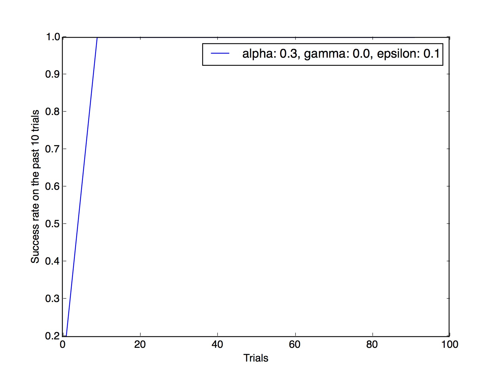
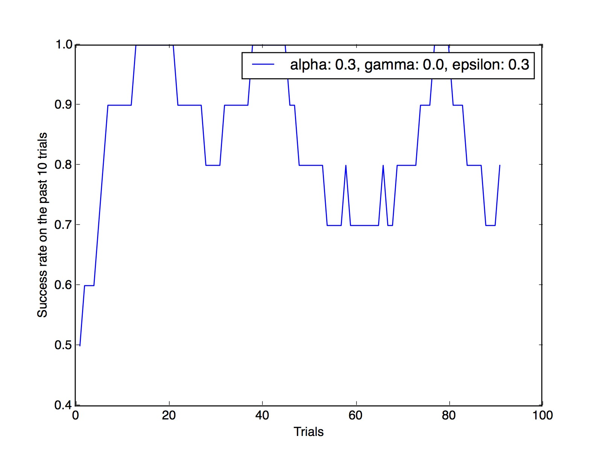
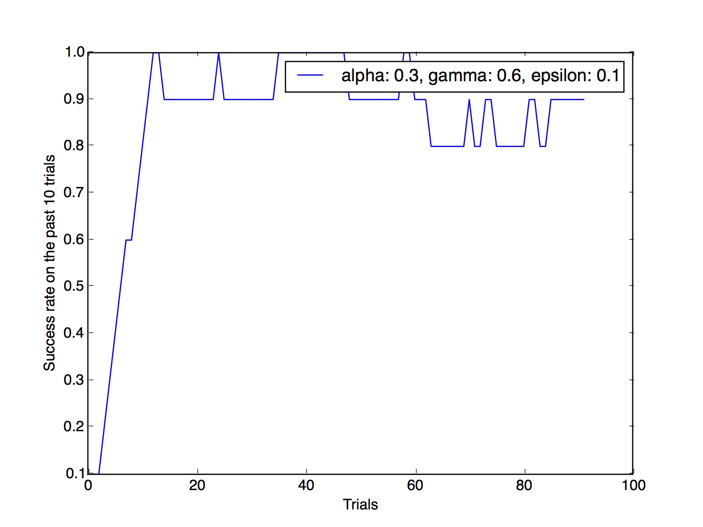
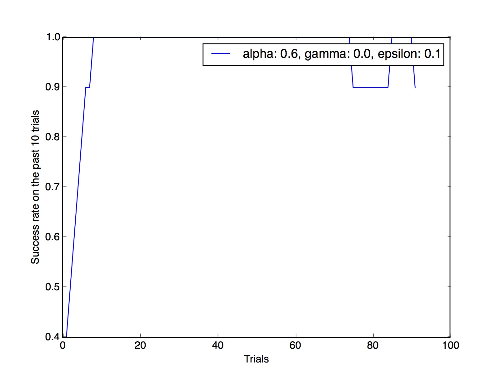
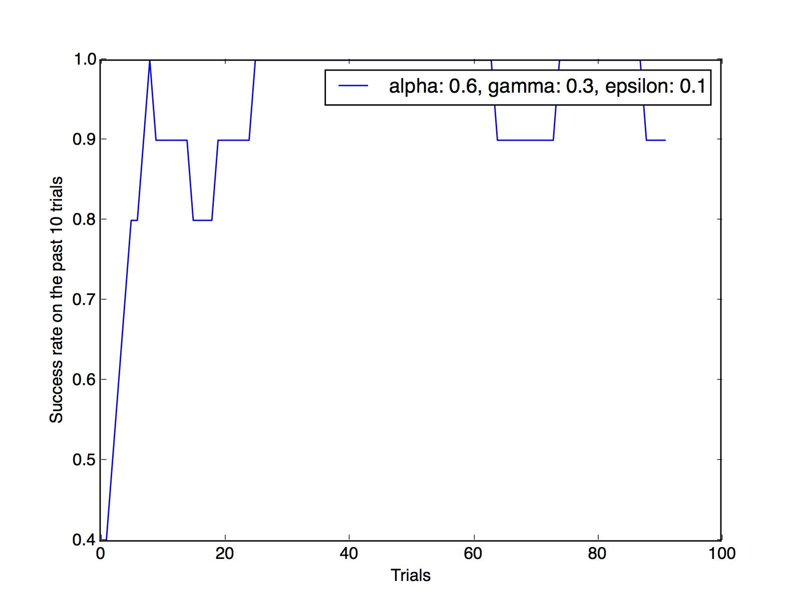
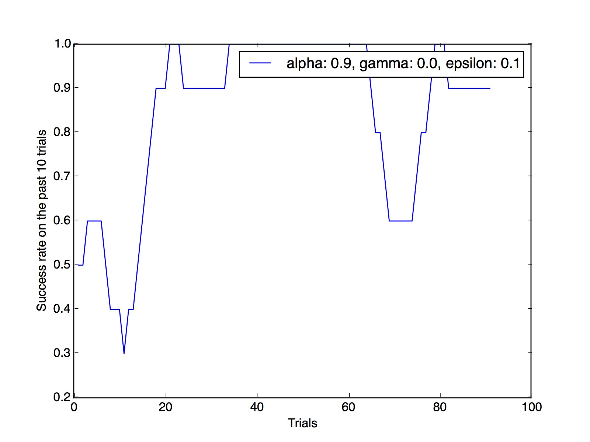
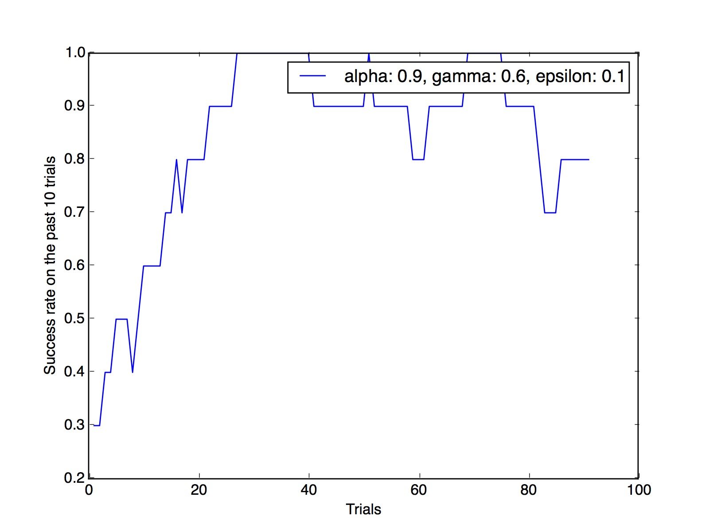
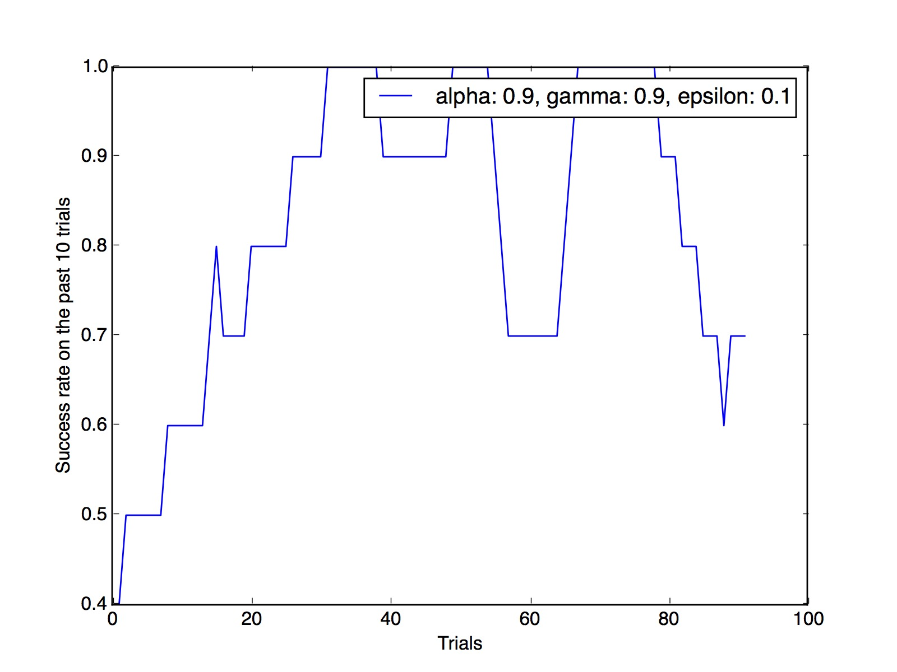

Kamal Kamalaldin

10/29/2016

Udacity MLND program

Smartcab project

###Project Report
This report is provided to answer all questions that are posed by the smartcab implementation. The questions are listed in order of implementation, and the answer is provided after each question.

# Question 1
#### Observe what you see with the agent's behavior as it takes random actions. Does the smartcab eventually make it to the destination? Are there any other interesting observations to note?
With the random choice implementation, the smartcab takes a very long time to reach the destination, and has no particular strategy as to how to reach it. With limited time, the smartcab almost never reaches its target. The smartcab seems to go opposite to the direction of the waypoint at times, which is not an optimal behavior.

#Question 2
#### What states have you identified that are appropriate for modeling the smartcab and environment? Why do you believe each of these states to be appropriate for this problem?
I identified the following the be important aspects of the state, and added reasons for why so:
1. Oncoming: This part of the state tells the cab if there are oncoming cars in traffic. This state variabel could inform the car's decision when facing a trafic light that has an oncoming car. If a car is oncoming, then the car should make a different decision from when there is no oncoming car.

3. left: These state variables tell the smartcab whether there is an incoming car from the left direction. (We don't care about the right direction because according to the US traffic laws, the right oncoming traffic should not affect whether you turn right or not, nor should it ever be influencing your left or straight turn.)

3. light: This is the color of the traffic light signal. It informs the cab that it is or isn't moving in the next time step. If it is not moving, then the smartcab might think it is actually advantageous to simply turn right at the red light, if permitted.

4. waypoint: This state variable tells the smartcab where it should be heading to next in order to get to the waypoint. This is perhaps the most important state variable.

#Question 3
####  How many states in total exist for the smartcab in this environment? Does this number seem reasonable given that the goal of Q-Learning is to learn and make informed decisions about each state? Why or why not?

Since the first 2 states can either be one of 4 variables (None, left, right, forward), the space for the state is 4^2= 16, th elight can hold two variables, and the waypoint can hold 3 variables, so that space is 4^2 * 3 * 2= 96, which is a manageable state space for a Q learning algorithm of this size and computational capacity.

# Question 4
#### What changes do you notice in the agent's behavior when compared to the basic driving agent when random actions were always taken? Why is this behavior occurring?

The agent, after 50 iterations, starts to head straight to the target (with accordance to traffic laws of the simulation). If the traffic light is red, the car does not move, otherwise, it would (usually) move in the direction of the waypoint. This behavior is occurring because of the Q learning algorithm I implemented. This algorithm ensures that the smartcab learns from the rewards it receives from the environment. In essence, the Q learning algorithm records and updates what the smartcab took at each state and the reward it received for that action. The policy of the smartcab is to take the best action given by the Q algorithm 75% of the time, and make a random choice 25% of the time. The 25% random choice ensures that the smartcab does not get stuck in a local minimum due to improper initialization or an early mistake.

# Question 5
#### Report the different values for the parameters tuned in your basic implementation of Q-Learning. For which set of parameters does the agent perform best? How well does the final driving agent perform?

##### *Note that the files Environment.py and Simulation.py were modified in order to allow the collection of simulation results.*
I implemented a graphing function taken from the different simulations with different ranges of values for alpha, gamma, and epsilon. This function plots the success rate of the last 10 trials, beginning from trial 10.

The following are some of the good parameters, and one is labeled as BEST.

* alpha: 0.3, gamma: 0.0, epsilon:0.1 
* alpha: 0.3, gamma: 0.0, epsilon:0.3
* alpha: 0.3, gamma: 0.6, epsilon:0.1 
* alpha: 0.6, gamma: 0.0, epsilon:0.1 
* alpha: 0.6, gamma: 0.3, epsilon:0.1 
* alpha: 0.9, gamma: 0.0, epsilon:0.1
* alpha: 0.9, gamma: 0.6, epsilon:0.1
* alpha: 0.9, gamma: 0.9, epsilon:0.1

# Question 6
#### Does your agent get close to finding an optimal policy, i.e. reach the destination in the minimum possible time, and not incur any penalties? How would you describe an optimal policy for this problem?

Yes! The agent gets very close to finding an optimal policy, given a good set of initial hyper parameters. The policy rate (epsilon) might sometimes influence the success of the smartcab since it results in a random move which may cause a long detour from the destination.
An optimal policy for this problem would have a somewhat high learning rate (0.6-0.9) and a somewhat medium to low utility rate (gamma), and a small exploration rate (epsilon). Although the small exploration might be harmful in the beginning of the training (because the smartcab might get stuck in a local minimum of optimality), in the long run the smartcab will make smaller random "mistakes" when implementing what it learned.
One of the optimal policies taken from the simulation was the 
* alpha: 0.9, gamma: 0.6, epsilon:0.1. 

I believe this is the best general learning parameters, but some others performed better in comparison, like
* alpha: 0.3, gamma: 0.0, epsilon:0.1 

which is a surprising parameter result. The first result is particularly surprising because it completely ignores gamma---the utility rate---and has a small learning rate, even though it appeared to learn quickly.

